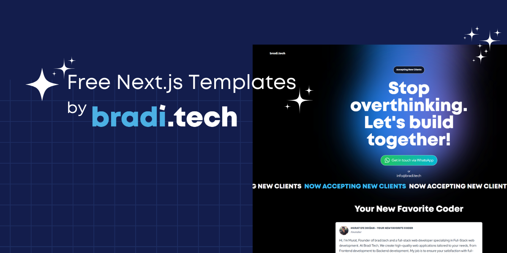

# Free Next.js Templates by bradi.tech

<div align="center">
  
</div>

<p align="center">
 Stop overthinking. Let's build together with production-ready Next.js templates!
</p>

<p align="center">
  <a href="#features"><strong>Features</strong></a> ·
  <a href="#templates"><strong>Templates</strong></a> ·
  <a href="#getting-started"><strong>Getting Started</strong></a> ·
  <a href="#support"><strong>Support</strong></a>
</p>

## Features

- 🚀 Built with Next.js App Router
- 💎 Modern and beautiful UI components
- 🔒 Authentication and authorization built-in
- 📱 Fully responsive designs
- 🎨 Tailwind CSS for styling
- ✨ Best practices and patterns
- 🛠️ Easy to customize and extend

## Templates

Our collection of templates helps you kickstart your next project with confidence. Each template is carefully crafted with modern best practices and beautiful design.

## Getting Started

1. Choose a template from our collection
2. Clone the repository
3. Install dependencies:
   ```bash
   npm install
   # or
   yarn install
   ```
4. Set up your environment variables
5. Run the development server:
   ```bash
   npm run dev
   # or
   yarn dev
   ```

## Support

Need help or want to discuss your project? Get in touch:

- 💬 [Get in touch via WhatsApp](https://bradi.tech)
- 🌐 Visit [bradi.tech](https://bradi.tech)
- 📧 Email us at info@bradi.tech

---

<p align="center">
  Built with ❤️ by <a href="https://bradi.tech">bradi.tech</a>
</p>
